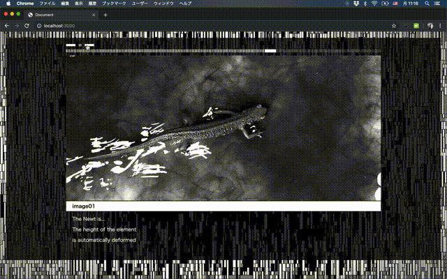

# `<rikaaa-tab>`
Custom elements for implementing simple tabs.




## Installation
```bash
#script tag
<script src="rikaaa-tab.js"></script>

#esm
import 'rikaaa-tab.js'
```
If you want to use browser that does not support webcomponent.
```bash
#script tag
<script src="node_modules/@webcomponents/webcomponentsjs/webcomponents-bundle.js"></script>
<script src="node_modules/@webcomponents/shadycss/scoping-shim.min.js"></script>

#ems
import '@webcomponents/webcomponentsjs/webcomponents-bundle';
import '@webcomponents/shadycss/scoping-shim.min';
```
## Usage 
```bash
#HTML
<rikaaa-tab>
    <button slot="tab">button1</button>
    <button slot="tab">button2</button>
    <button slot="tab">button3</button>
    <div slot="bar"><span class="bar">seek bar</span></div>
    <section>panel 1:write in your contents 1</section>
    <section>panel 2:write in your contents 2</section>
    <section>panel 3:write in your contents 3</section>
</rikaaa-tab>
```
* elective tag
    * ``` bash
        <button slot="tab">button1</button>
         ```
    * ``` bash
        <div slot="bar"><span class="bar">seek bar</span></div>
         ```
* require tag
    * ``` bash
        <section>panel 1:write in your contents 1</section>
         ```

## Options
```bash
#Attribute
<rikaaa-tab seekbarh="3" seed="0" index="0" tabchangeduration="200" horizon="false" opmin="0">
```
1. seekbarh="int" : you can setting seekbar height. defult is 3.

1. seed="float(0. 〜 1.)" : Switching condition value. defult is 0.

1. index="int(0 〜 panel length)" : Switching condition value by int. defult is 0.

1. abchangeduration="milliseconds" : Switching speed. defult is 200.

1. horizon="boolean" : Switching tab layout. defult is false. 

1.  opmin="float(0. 〜 1.)" : alid only when -horizon = "true"- Set the minimum value of opacity of the element not selected. defult is 0.


```bash
#Event and Function
const tab = document.getElementsByTagName("rikaaa-tab")[0];

tab.next(); // Change next tab

tab.prev();// Change prev tab

a.addEventListener("onfade", function (e) { // Fires while tab is fading.

    console.log(e.detail.seed); //return seed value.

    console.log(e.detail.fade); //return array. This is switching status of each tab.

});
```

## Browser Support
- Google Chrome  
- Safari  
- Firefox  
- Edge  
- IE 11+ (When using polyfill)

## License
MIT © [rikaaa.org](http://rikaaa.org/)
